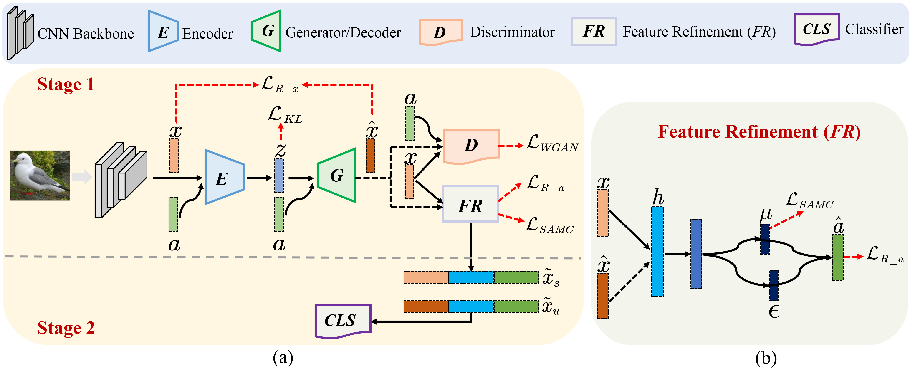

# FREE
This repository contains the reference code for the paper "**FREE: Feature Refinement for Generalized Zero-Shot Learning**" accepted to ICCV 2021. [[arXiv]](https://arxiv.org/pdf/2107.13807.pdf)[[Paper]](https://github.com/shiming-chen/FREE)




## 1. Preparing Dataset and Model
Datasets can be download from [Xian et al. (CVPR2017)](https://datasets.d2.mpi-inf.mpg.de/xian/xlsa17.zip) and take them into dir `data`.
## Requirements
The code implementation of **FREE** mainly based on [PyTorch](https://pytorch.org/). All of our experiments run in Python 3.8.8.

## 2. Runing
Before running commands, you can set the hyperparameters in config.py. Please run the following commands and testing **FREE** on different datasets: 
```
$ python ./image-scripts/run-cub.py       #CUB
$ python ./image-scripts/run-sun.py       #SUN
$ python ./image-scripts/run-flo.py       #FLO
$ python ./image-scripts/run-awa1.py      #AWA1
$ python ./image-scripts/run-awa2.py      #AWA2
```

**Note**: All of above results are run on a server with one GPU (Nvidia 1080Ti).


## 3. Citation
If this work is helpful for you, please cite our paper.

```
@InProceedings{Chen_2021_ICCV,
    author    = {Chen, Shiming and Wang, Wenjie and Xia, Beihao and Peng, Qinmu and You, Xinge and Zheng, Feng and Shao, Ling},
    title     = {FREE: Feature Refinement for Generalized Zero-Shot Learning},
    booktitle = {Proceedings of the IEEE/CVF International Conference on Computer Vision (ICCV)},
    year      = {2021},
    pages     = {122-131}
}
```

## 4. Ackowledgement
We thank the following repos providing helpful components in our work.
1. [TF-VAEGAN](https://github.com/akshitac8/tfvaegan)
2. [cycle-CLSWGAN](https://github.com/rfelixmg/frwgan-eccv18)
